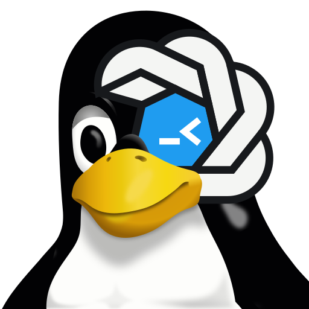

<div align="center">
  
  <h1>ChatGPT for Linux</h1>
  <p><strong>A hardened, package-ready ChatGPT desktop build for Linux.</strong></p>
  <p>
    <a href="#quick-start"></a>
    <a href="#local-updater"></a>
    <a href="#highlights"></a>
  </p>
</div>

This build currently converts the official OpenAI ChatGPT app from its macOS
DMG. It layers package identity, updater policy, hardening, and runtime polish
over the Linux conversion work from
[`ilysenko/codex-desktop-linux`](https://github.com/ilysenko/codex-desktop-linux),
aimed at users who want a polished local app and maintainers who want auditable
native packages.

> [!NOTE]
> OpenAI has released an official ChatGPT app for Linux. We are evaluating
> whether it meets this project's essential feature-parity and operating needs.
> If the official release is acceptable, ChatGPT for Linux will be sunset.
> Until that decision, this project remains a maintained fallback.

OpenAI's official Linux package and this project's native packages both use the
`chatgpt` package and command name, so they are mutually exclusive on one host.
The accepted [package-switch procedure](docs/maintainers/package-runtime-maintenance.md)
preserves shared state and one active update authority while maintainers
alternate between them during evaluation. The official Linux package is not
this fork's current build source.

> [!IMPORTANT]
> **ChatGPT for Linux is an unofficial community project.** It is not affiliated
> with, endorsed by, sponsored by, or supported by OpenAI. OpenAI owns ChatGPT,
> Codex, the official app, and the OpenAI-hosted services this build uses. This repository
> does not redistribute the official app bundle; it automates a local conversion
> from the official OpenAI ChatGPT DMG. The project logo is independent community
> artwork derived from Tux; it is not an OpenAI mark. Tux credit: Larry Ewing and
> The GIMP, Garrett LeSage, and IFo Hancroft. The logo's provenance, construction,
> and bounded rights assessment are documented in the
> [project-logo rights record](docs/maintainers/project-logo-rights-research.md).
> The repository license covers this fork's source code and packaging work, not
> the downloaded OpenAI app or services. Your use of OpenAI software and services
> remains subject to OpenAI's terms.

## Start Here

- **Normal package-managed app:** use [Quick Start](#quick-start).
- **NixOS:** use [NixOS](#nixos).
- **Checkout, custom DMG, or side-by-side test app:** use
  [Manual and Custom Builds](#manual-and-custom-builds).
- **AppImage or package details:** use
  [Native Package Details](#native-package-details).
- **Where to report issues:** use
  [Support and Issue Routing](docs/usage/support-routing.md).
- **Computer Use, updater, release, or maintainer work:** use
  [Linux Computer Use](#linux-computer-use) and [Learn More](#learn-more).
- **Port integrations and architecture:** use the
  [Documentation Index](docs/README.md) to choose the catalog, configuration,
  authoring, or design document for the task.

## Quick Start

This is the normal fast path for a package-managed install. It removes old
generated output, rebuilds the Linux app from the official OpenAI ChatGPT DMG,
builds the native package for your host, then installs that package with your
distro's package manager.

For the guided one-command path, clone the repository and run
`make bootstrap-native`. It installs host dependencies, builds and packages
the app, and installs the resulting native package. The expanded flow below is
useful when you want to inspect the package before installing it.

```bash
git clone https://github.com/nisavid/codex-app-linux.git codex-app-linux
cd codex-app-linux
bash scripts/install-deps.sh
make clean build-app package
```

Install the package that `make package` wrote to `dist/`:

```bash
# Debian / Ubuntu
sudo apt install ./dist/chatgpt_*.deb

# Fedora 41+
sudo dnf5 install ./dist/chatgpt-*.rpm

# Fedora with dnf
sudo dnf install ./dist/chatgpt-*.rpm

# openSUSE
sudo zypper --non-interactive --allow-unsigned-rpm install -y ./dist/chatgpt-*.rpm

# Arch Linux
sudo pacman -U ./dist/chatgpt-*.pkg.tar.zst
```

Then launch:

```bash
chatgpt
```

`scripts/install-deps.sh` supports Debian/Ubuntu-family, Fedora, openSUSE, and
Arch-family hosts. The generated package bundles a managed Linux Node.js
runtime for normal app use, Browser Use, Codex CLI install/update, and updater
rebuilds.

On hardened systems where `/tmp` is mounted `noexec`, set `TMPDIR` and
`XDG_CACHE_HOME` to user-owned executable locations before installing or
building. See [Troubleshooting](docs/usage/troubleshooting.md) for a compact
workaround.

For an interactive preflight summary before building, run:

```bash
make setup-native
```

The guided setup helper detects the host package manager, desktop session,
package format, updater hints, Computer Use readiness signals, and optional
port integration config. It can write the git-ignored
`port-integrations/integrations.json` file for the next build, but it does not run the
build, package, or install flow unless you explicitly opt in through
`CHATGPT_BOOTSTRAP_INSTALL_DEPS=1` or `CHATGPT_BOOTSTRAP_INSTALL_NATIVE=1`.

## Upgrading From Codex App

The `chatgpt` packages replace the former `codex-app` and
`codex-desktop` package identities. They do not install compatibility commands,
launchers, desktop files, or service aliases. Use `chatgpt` and
`chatgpt-updater` after upgrading.

Before ChatGPT creates any new runtime state, the launcher and updater move this
fork's existing XDG directories from `codex-app` to `chatgpt` and from
`codex-app-updater` to `chatgpt-updater`. The migration also moves the
wrapper-owned CLI quarantine directory, discards volatile pid, socket, lock, and
temporary files, rewrites known wrapper-owned paths and setting keys, and records
progress in `${XDG_STATE_HOME:-$HOME/.local/state}/.chatgpt-state-migration.json`.
Interrupted work resumes on the next launch.

Migration is atomic and refuses symlinks, unexpected file types, cross-filesystem
moves, and collisions. If both an old and a new directory exist, no directories
are merged or replaced. Follow the exact `Recovery command:` printed by the
launcher; it moves the new directory aside and reruns `chatgpt`. To roll a
completed migration back to the former XDG names, close the app and run:

```bash
chatgpt migrate-state --reverse
```

Reverse migration uses the same journal, collision checks, and fail-closed path
validation. It restores data names only; it does not reinstall the former package
or add compatibility shims.

## Uninstall

Close ChatGPT, then remove the native package with your distro's package
manager:

```bash
# Debian / Ubuntu
sudo apt remove chatgpt

# Fedora
sudo dnf remove chatgpt

# openSUSE
sudo zypper remove chatgpt

# Arch Linux
sudo pacman -R chatgpt
```

Package removal stops and disables `chatgpt-updater.service`. If a service
from an older or manual install remains, remove its user-level enablement with
`systemctl --user disable --now chatgpt-updater.service`. AppImage and
checkout builds are not system-installed; remove the artifact or generated tree
you created. User configuration and state are preserved for reinstall.

## Highlights

- **Distro-shaped native packages.** Builds `.deb`, `.rpm`, and pacman packages
  under the `chatgpt` identity, with package-managed install roots and XDG
  user state. AppImage self-builds are available for manual-update systems.
- **Updater with a narrow privilege boundary.** `chatgpt-updater` checks DMGs,
  rebuilds packages, tracks state, and uses `pkexec` only for final package
  installation.
- **Managed runtime and CLI preflight.** Native packages bundle the Linux
  Node.js runtime used by Browser Use, Codex CLI install/update, and updater
  rebuilds.
- **Release and supply-chain evidence.** The release gate verifies reviewed DMG
  hashes, scans generated Electron output, validates package metadata, writes
  checksums, and supports detached signatures.
- **Computer Use packaging compatibility.** The Linux-port upstream's Linux
  Computer Use backend is staged under this fork's package identity while the
  official persistent control, account rollout, and host accessibility gates
  stay separate.

## Current State

- **Working:** the standard ChatGPT app UI, native packages, AppImage self-builds,
  local updater, managed runtime, Codex CLI preflight, Chrome native host,
  browser resources, and port integration registry.
- **Desktop-dependent:** tray behavior, warm start, multi-instance launches,
  and Linux keybind handling can vary by desktop environment.
- **Host-gated:** Linux Computer Use is packaged, but real readiness depends on
  local AT-SPI, screenshot portal or compositor support, `ydotool`, and input
  permissions.
- **Curated port integrations:** the manifest-declared defaults cover app
  workflow, project, update, remote-control, speech, theme, and status surfaces.
  `make setup-native` shows the current set. Integration-specific settings,
  account rollouts, MFA, connected-client, audio, and host-network requirements
  still apply.
- **NixOS:** the flake exposes the default app, remote-mobile compatibility
  alias, and installer output with pinned DMG metadata. Computer Use support is
  part of the default app and remains subject to its official controls.
- **OpenAI-gated:** installing this fork cannot bypass server-side feature flags
  or account policy.

## About This Fork

This fork is a downstream maintenance fork of
[`ilysenko/codex-desktop-linux`](https://github.com/ilysenko/codex-desktop-linux).
This fork's synced baseline carries the Linux-port upstream's core DMG-to-Linux
conversion and runtime enablement. Current Linux-port upstream development now
starts from OpenAI's official Linux package; this fork has not adopted that
source transition. It keeps the local `chatgpt` package identity, install
layout, updater policy, hardening posture, and maintenance workflow coherent on
top of the synced baseline.

For the full inventory of fork-specific contracts, see
[`docs/maintainers/fork-divergences.md`](docs/maintainers/fork-divergences.md).

## Manual and Custom Builds

Use these paths when you do not want the normal package-managed install.

Build and run directly from the checkout:

```bash
make build-app
make run-app
```

`make build-app` downloads or reuses `ChatGPT.dmg`, extracts the app, patches the
macOS bundle for Linux, rebuilds native modules, downloads a Linux Electron
runtime, and writes `chatgpt/start.sh`.

App generation is transactional. The candidate must pass the shared
[official DMG acceptance profile](docs/upstream-dmg-acceptance.md) before it
replaces the working `chatgpt/`. Acceptance checks enabled port integrations;
rejected or inconclusive candidates preserve the current app.

On first launch, the app can install the Codex CLI if it is missing. To install
the CLI yourself with an existing `npm` command:

```bash
npm i -g --include=optional @openai/codex
```

If global npm installs require elevated privileges on your system, use a
rootless prefix instead:

```bash
npm i -g --prefix ~/.local --include=optional @openai/codex
```

The Linux optional dependency supplies the platform binary. The launcher uses
`CODEX_CLI_PATH` first, then its normal lookup order. It pins the resolved
executable while preserving `codex` as the invocation name for multicall
installations, and logs the selected source, pinned target, and best-effort
version for GUI `PATH` troubleshooting.

Build from a DMG you already downloaded:

```bash
make build-app DMG=/path/to/ChatGPT.dmg
```

If Electron runtime or header downloads are slow or blocked, use
`ELECTRON_MIRROR` or `ELECTRON_HEADERS_URL`; the
[Build and Run Guide](docs/usage/build-and-run.md) has the exact knobs.

For a side-by-side test app with a distinct app id and webview port:

```bash
make build-dev-app
make run-dev-app
```

Normal launches reuse a running app through the warm-start handoff. To start an
additional isolated instance instead, pass `--new-instance` or set
`CHATGPT_MULTI_LAUNCH=1`; the launcher chooses the first free webview port in a
bounded range and uses per-port pid, socket, log, and Electron user-data paths.

```bash
./chatgpt/start.sh --new-instance
CHATGPT_MULTI_LAUNCH=1 CHATGPT_MULTI_LAUNCH_PORT_RANGE=5175-5199 ./chatgpt/start.sh
```

## Port Integrations

Port integrations are build-time integration modules that adapt official ChatGPT app
behavior and local runtime helpers to this Linux port. The source path is
`port-integrations/`, but the modules are not features of Linux itself,
and their user-facing concepts are not necessarily Linux-only ChatGPT features.

This fork enables the reviewed integration set declared by each manifest. Run
`make setup-native` to review the current defaults. The default set includes
workflow and project helpers, wrapper update UI, remote-control compatibility,
speech and dictation, theme and status helpers, API-key model metadata, shared
app-server and SSH routing, Pet Overlay, and UI Tweaks. Resource-heavy,
privilege-sensitive, or still-deferred integrations remain disabled.

Default enablement never replaces a feature's own runtime gates. Agent Workspaces
preserves its approval and permission controls; AppShots keeps global hotkeys
inactive until configured; wrapper update checks stay off until enabled in
Settings; and Open Target Discovery validates desktop targets. UI Tweaks enables
Suggested Prompts by default; its official ChatGPT/Codex Dock-icon selector is
opt-in so the project logo remains the default app identity. When enabled,
Dock-icon synchronization creates, updates, and removes only marker-owned
ChatGPT desktop and icon files; it leaves unmanaged launchers and favorites
untouched. Suggested Prompts requires
the official app's eligibility, the user's setting, and supported local
Linux patch contracts at the same time. Main-process hardening for direct
workspace bridge calls is tracked in
[`#99`](https://github.com/nisavid/codex-app-linux/issues/99).

To disable default integrations, enable still-optional integrations, or set
integration-specific options, copy
`port-integrations/integrations.example.json` to the git-ignored
`port-integrations/integrations.json`, edit the `enabled` and `disabled` lists, then
rebuild. Packaged installs can use
`${XDG_CONFIG_HOME:-$HOME/.config}/chatgpt/port-integrations.json` for the same
override shape; checkout builds ignore that persistent user file and use
`port-integrations/integrations.json` or `CHATGPT_PORT_INTEGRATIONS_CONFIG` instead.
Updater rebuilds prefer the saved user override, then the resolved integration
snapshot shipped in the native package, then the legacy builder config. They do
not silently replace an available selection. If none of those three inputs
exists, the fetched wrapper's manifest defaults provide the initial selection.
See [`port-integrations/README.md`](port-integrations/README.md) for the integration
contract.

Port integrations expose official app surfaces and local runtime helpers through
Linux-specific implementation code. Treat them as UI/runtime integrations, not
as account-policy bypasses: OpenAI rollouts, MFA state, connected-client state,
audio availability, remote-control enrollment, and host network exposure still
come from OpenAI-hosted services and your local environment.

## Native Package Details

Native package builders repackage the generated app tree. The quick path uses
`make clean build-app package` so the app tree, cached DMG, and old package
outputs all start fresh.

If `chatgpt/` already exists and you only need to rebuild the package, use:

```bash
make package
```

Choose a format directly when needed:

```bash
make deb
make rpm
make pacman
```

`make build-app` publishes a sibling, content-addressed generation receipt
under `.chatgpt-generation-receipts/`. The receipt binds the exact mutation
broker, generated app manifest, and `.chatgpt-linux/build-info.json`. Keep the
generated app and that sibling receipt root together; native package builders
reject a missing or mismatched receipt before staging app bytes.

The repository-approved offline `@parcel/watcher` bundle supports Linux glibc
on x86_64, arm64/aarch64, and ARMv7 hard-float hosts. App generation rejects
other platform, architecture, or libc combinations before invoking npm.

Convenience targets are available when you want Make to run more of the native
install lifecycle:

```bash
make bootstrap-native
make install-native
```

`make bootstrap-native` installs dependencies first, then runs the fresh app
build, package build, and install flow. `make install-native` assumes
dependencies are already present.

To build a package without installing `chatgpt-updater`, its user service, or
its polkit/update-builder support files, disable the updater at package build
time:

```bash
PACKAGE_WITH_UPDATER=0 make package
```

No-updater packages also remove stale `chatgpt-updater.service` enablement
when installed over a default package. They are local/manual-update artifacts;
the public release gate requires the reviewed updater and its support bundle.

Package outputs land in `dist/`:

| Target | Output |
| --- | --- |
| Debian | `dist/chatgpt_<app-version>_<arch>.deb` |
| RPM / Fedora / openSUSE | `dist/chatgpt-<app-version>-1.<arch>.rpm` |
| Arch Linux | `dist/chatgpt-<app-version>-1-<arch>.pkg.tar.zst` |
| AppImage | `dist/chatgpt-<app-version>-<arch>.AppImage` |

Architecture names follow the package format: Debian uses `amd64`, `arm64`, or
`armhf`; RPM uses `x86_64`, `aarch64`, or `armv7hl`; pacman uses `x86_64` or
`aarch64`.

The package version comes from the official OpenAI app bundle's
`CFBundleShortVersionString`. For example, `26.422.30944 (2080)` becomes
`26.422.30944`.

Native packages are named `chatgpt`. They declare replacement, conflict, and
provider metadata for the former `codex-app` and `codex-desktop` package names
where the package format supports it. They do not ship executable or service
compatibility shims.
The installed launcher is `/usr/bin/chatgpt`, and the app lives under
`/opt/chatgpt`.

Native packages bundle the managed Node.js runtime used by the launcher, Browser
Use, Codex CLI install/update flow, and local auto-update rebuilds. They do not
hard-depend on distro `nodejs` or `npm`.

`make install` is a convenience wrapper around the package-manager install
commands shown in [Quick Start](#quick-start). It installs the newest matching
package in `dist/`.

For atomic desktops or systems where installing a native package is awkward,
build a local AppImage after `chatgpt/` exists:

```bash
make appimage
./dist/chatgpt-*.AppImage
```

The AppImage flow omits `chatgpt-updater`, the systemd user service, polkit
policy, and the native-package update-builder bundle. Rebuild it manually when
you want a newer official OpenAI app bundle.

To embed an installed Codex CLI and its matching Linux platform package, set
`CHATGPT_CLI_BUNDLE_SOURCE` to its `node_modules/@openai/codex` directory when
running `make appimage`. An explicit runtime `CODEX_CLI_PATH` still takes
precedence.

Before publishing packages, build the candidate package from the Nix
`chatgpt-release-app` and `release-helpers` outputs, then run the release gate
against that app and the pinned `chatgpt-dmg` output:

```bash
APP_DIR=<chatgpt-release-app-store-path>/opt/chatgpt \
DMG=<chatgpt-dmg-store-path> \
PACKAGE_WITH_UPDATER=1 \
REQUIRE_RELEASE_SIGNATURE=1 \
CHATGPT_RELEASE_GPG_KEY=<key-id-or-email> \
CHATGPT_RELEASE_GPG_FINGERPRINT=<approved-primary-fingerprint> \
make release-gate
```

Public mode requires a root-managed multi-user Nix daemon with sandboxing
enabled. The gate snapshots the clean source and DMG, independently builds the
portable `chatgpt-release-app` and static `release-helpers` outputs, and requires
the submitted app to match the `chatgpt-release-app` reference exactly. It then
uses that reference, not the submitted tree, as package authority. Payload and
install controls must match; RPM bytes must also match the deterministic
reference package. Public packages require `PACKAGE_WITH_UPDATER=1`. Public mode
writes signed `SHA256SUMS` and
`RELEASE-PROVENANCE.json` attestations. For a local unsigned rehearsal, set
`CHATGPT_RELEASE_REHEARSAL=1`; a default invocation is a public release and
fails without signing controls. Consumers must verify the signing-key
fingerprint against the approved value supplied to the gate through an
independently trusted project channel rather than trusting only the
co-published key. See the
[Build and Run Guide](docs/usage/build-and-run.md) and
[Package and Runtime Maintenance](docs/maintainers/package-runtime-maintenance.md)
for release details.

## NixOS

The flake handles dependencies and Electron patching under the local
`chatgpt` identity:

```bash
nix run github:nisavid/codex-app-linux
```

This builds the flake's default ChatGPT package in the Nix store and launches
it. Use the `#installer` app below when you specifically want a generated
`chatgpt/` directory in the current checkout. For a development shell:

```bash
nix develop github:nisavid/codex-app-linux
```

The remote-mobile output is retained as a compatibility alias for the
manifest-default-enabled mobile integration. The installer output generates
`chatgpt/` in the current checkout using the ordinary port integration
selection:

```bash
nix run github:nisavid/codex-app-linux#chatgpt-remote-mobile-control
nix run github:nisavid/codex-app-linux#installer
```

For a declarative NixOS or Home Manager install with the mobile remote-control
app-server managed by systemd, import the flake module:

```nix
{
  imports = [
    inputs.chatgpt-linux.homeManagerModules.default
  ];

  programs.chatgptLinux = {
    enable = true;
    remoteMobileControl.enable = true;
    remoteControl.enable = true;
  };
}
```

`nixosModules.default` is also available for system-level configurations that
prefer a global user unit.

If `nix run` reports a DMG metadata mismatch, OpenAI likely republished the
ChatGPT DMG after the pinned metadata changed. A scheduled GitHub Actions job
refreshes that metadata and verifies the Nix package outputs on `main`. Retry
after the bot has had time to run; if it still fails, open an issue.

## Linux Computer Use

Linux Computer Use support is packaged from the Linux-port upstream's Rust MCP
backend. The backend can inspect apps through AT-SPI, capture screenshots
through XDG Desktop Portal or compositor paths, and synthesize input through a
uinput absolute pointer, XDG Desktop Portal RemoteDesktop sessions, or
`ydotool` when the host is configured for them.

Runtime readiness depends on the host. Input synthesis usually requires
`ydotool`/`ydotoold`, `/dev/uinput` access, and a socket usable by your desktop
user. Non-GNOME desktops usually also need the matching XDG Desktop Portal
backend, such as the KDE or wlroots portal.

Keyboard input follows the desktop's active keyboard layout and remapping. When
troubleshooting literal keys or shortcuts on a non-QWERTY layout, retry once with
a standard US/QWERTY layout before debugging lower-level input services. Some
apps also expose only sparse AT-SPI trees even when the backend is ready;
screenshot and pointer paths can still work for those apps.

The plugin manifest and Linux support patches are applied by default so the
backend can register when the official app is eligible. OpenAI account and
rollout policy, ChatGPT's persistent Computer Use and allowed-app controls, and
Codex tool approval, sandboxing, and auto-approval policy remain authoritative.
This fork adds no duplicate consent prompt or setting. Disable or revoke
Computer Use through those existing controls; future ChatGPT-originated actions
must then be rejected. OS portal prompts may still appear when the desktop owns
that permission.

Linux support and host readiness determine whether an authorized action can
succeed. They are not separate permissions and do not bypass OpenAI policy.

After building the app, check local readiness with:

```bash
./chatgpt/resources/plugins/openai-bundled/plugins/computer-use/bin/chatgpt-computer-use-linux doctor
```

## Local Updater

Native packages install `chatgpt-updater`, a `systemd --user` service that
checks for newer official OpenAI ChatGPT DMGs, rebuilds the matching Linux package
locally, and uses `pkexec` only for the final package install step.

Current updater crate version: `0.10.4`.

Useful service commands after installing a native package:

```bash
make service-enable
make service-status
chatgpt-updater status --json
```

The packaged launcher also starts the user service on a best-effort basis when
you open the app.

If a rebuilt update installs but the previous retained package was better,
close ChatGPT and run:

```bash
chatgpt-updater rollback
```

Rollback uses the last retained known-good package and refuses to run when no
rollback package is available.

## Troubleshooting

Start with the launcher log:

```bash
sed -n '1,160p' ~/.cache/chatgpt/launcher.log
```

Common next steps:

- blank window or splash hang: check whether something else is serving port
  `5175`;
- Codex CLI warning: install `@openai/codex` with optional packages globally
  or under `~/.local`;
- hardened `/tmp` with `noexec`: set `TMPDIR` and `XDG_CACHE_HOME` to
  executable user-owned paths before install/build;
- Electron download issues: retry, or set `ELECTRON_MIRROR` and
  `ELECTRON_HEADERS_URL` for your network;
- stale app tree: rebuild with `make clean build-app package`, or use
  `./install.sh --fresh` for a checkout-only build;
- Computer Use readiness: run the backend `doctor` command and check
  `ydotoold`, `/dev/uinput`, portal, and AT-SPI status;
- Fedora Computer Use input issue: some Fedora releases package the daemon as
  `ydotool.service` rather than `ydotoold.service`; if `doctor` reports
  `ydotool_socket: Permission denied`, confirm the socket is usable by users in
  the `input` group;
- updater service issue: inspect
  `~/.local/state/chatgpt-updater/service.log`.
- `Critical patch failures` during a local or updater rebuild: update the
  checkout or installed update-builder and rebuild from the same DMG. For a
  local build, inspect `dist-next/rebuild/patch-report.json` and
  `chatgpt/.chatgpt-linux/build-info.json`; for an updater rebuild, inspect the
  workspace `.chatgpt-linux/source-info.json` and patch report. Do not disable
  critical enforcement except for a deliberately non-release emergency build.

See [Troubleshooting](docs/usage/troubleshooting.md) for the full symptom table
and log locations.

## Learn More

| Goal | Go here |
| --- | --- |
| Build, run, package, install, or customize the app | [Build and Run Guide](docs/usage/build-and-run.md) |
| Understand how the DMG conversion works | [Port Architecture](docs/port-architecture.md) |
| Configure or author a port integration | [Port Integrations](port-integrations/README.md) and [Port Integration Architecture](docs/port-integrations-architecture.md) |
| Diagnose launch, CLI, webview, or updater issues | [Troubleshooting](docs/usage/troubleshooting.md) |
| Decide where to report an issue or feature request | [Support and Issue Routing](docs/usage/support-routing.md) |
| Set up or debug Linux Computer Use | [Build and Run Guide](docs/usage/build-and-run.md#linux-computer-use-controls-and-readiness) and [Troubleshooting](docs/usage/troubleshooting.md) |
| Browse all repo docs by role and task | [Documentation Index](docs/README.md) |
| Contribute a change | [Contributing](CONTRIBUTING.md) |
| Follow release notes | [Changelog](CHANGELOG.md) |
| Try the experimental rootless install path | [User-Local Desktop Integration](contrib/user-local-install/README.md) |
| Maintain packaging, launcher, or updater behavior | [Package and Runtime Maintenance](docs/maintainers/package-runtime-maintenance.md) |

For contributors and maintenance agents, start with `AGENTS.md`. It is the
always-loaded policy surface; detailed recipes and validation matrices live in
the docs linked above.
