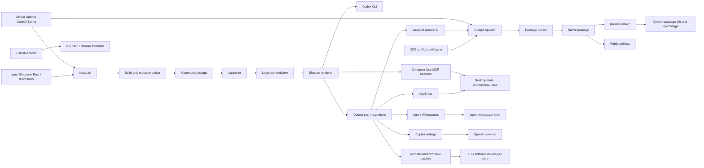

# ChatGPT for Linux Threat Model

Date: 2026-07-31

This repository adapts the official OpenAI `ChatGPT.dmg` into a Linux Electron
app, builds native Linux packages, and ships `chatgpt-updater` to check,
rebuild, and install local updates. This threat model is repository-scoped and
feeds future `@codex-security` reviews. Track actionable implementation work in
[Security Backlog](security-backlog.md).

Use this document to scope security scans and reviews. Use the security backlog
for implementation tickets, and use
[Package and Runtime Maintenance](package-runtime-maintenance.md) for package,
launcher, updater, and validation procedures.

## Executive Summary

The highest-risk areas are:

1. **Mutable official DMG trust.** The installer and updater convert the
   official OpenAI ChatGPT DMG into a local Linux app and package. A bad official
   artifact, wrong trust root, compromised download, or stale verification
   result can become a root-owned package.
2. **Privilege transition.** The updater is intentionally unprivileged until it
   invokes `pkexec` install subcommands. Anything crossing that boundary must be
   tightly bound to a verified package identity and digest.
3. **Desktop and renderer containment.** The generated Electron app, local
   webview server, Codex CLI, Linux Computer Use backend, and default-enabled
   port integrations all run with the user's desktop privileges. A renderer,
   plugin, localhost, CLI, or same-user XDG config compromise can affect local
   files, screenshots, input, remote-control device keys, helper command
   selection, update prompts, and user processes.

The repository already has meaningful hardening: HTTPS-only non-loopback DMG
URLs, URL redaction, partial downloads, package metadata checks, private staged
install copies, package payload symlink rejection, package mode normalization,
builder-root permission checks, trusted DMG metadata gating for unattended
updater rebuilds and installs, package digest binding for updater-managed
privileged installs, default-enabled Electron sandboxing, release gate checks,
Apple DMG verification tooling, descriptor-based required patch validation,
capability-mediated central main-bundle and webview mutation that poisons on
integrity failure, private transactional candidate roots, external
content-addressed generation receipts that bind broker, app, and build info
before native package staging, approved offline Parcel watcher bytes with an
exact Linux glibc host-target allowlist,
sanitized Linux desktop-target launches, loopback-only no-cache webview serving,
no-updater transition cleanup under package-owned support paths, default-enabled
remote-control UI/mobile patching, private AppShots temporary capture staging,
`0600` Linux remote-control device-key storage under XDG config, marker-owned
Dock-icon synchronization, three-gate Suggested Prompts enablement, and atomic
journaled migration of wrapper-owned XDG identity. The
remaining critical gaps are generated app security review evidence, public
artifact provenance, Agent Workspaces main-process bridge hardening, and a
general-readiness review for the experimental remote-control/mobile host
boundary.

## Scope

In scope:

- Installer and generated launcher sources: `install.sh`,
  `launcher/start.sh.template`, `launcher/webview-server.py`, and
  `scripts/lib/`.
- ASAR and generated-app inspection tooling:
  `scripts/patch-linux-window-ui.js`,
  `scripts/patch-linux-window-ui.test.js`, `scripts/patches/`,
  `generated-app-mutation-broker/`,
  `scripts/lib/port-integrations.js`, `scripts/lib/linux-target-context.js`, and
  `scripts/inspect-electron-security.js`.
- Native package builders and templates: `scripts/build-deb.sh`,
  `scripts/build-rpm.sh`, `scripts/build-pacman.sh`, `scripts/lib/package-common.sh`,
  and `packaging/linux/`.
- Updater service and CLI: `updater/`, `updater/Cargo.toml`, and updater tests.
- Linux Computer Use backend and bundled plugin resources:
  `computer-use-linux/` and `plugins/openai-bundled/plugins/computer-use/`.
- Port integration patches in `port-integrations/`, including
  default-enabled desktop target discovery, remote-control/mobile integration
  patches, and integration-specific
  generated-app patches.
- Release, CI, and Nix trust roots: `.github/workflows/`, `Makefile`,
  `flake.nix`, `flake.lock`, `Cargo.toml`, and `Cargo.lock`.
- Maintainer docs that define security workflow, package behavior, and fork
  contracts.

Generated/runtime artifacts are security-relevant but are not durable source:
`chatgpt/`, side-by-side `*-app/` output, `dist/`, `ChatGPT.dmg`, and XDG config/state/cache
paths. Inspect them when validating behavior, but fix source scripts, package
templates, updater code, or workflows.

Out of scope:

- Security guarantees made by OpenAI backend services, account rollout policy,
  remote-control enrollment policy, mobile clients, or the official OpenAI
  macOS app outside the local conversion and packaging path.
- Claims about a specific generated `app.asar` bundle until it has been built
  from a specific DMG and inspected.
- Host package-manager, polkit, npm registry, Electron release, GitHub Actions,
  and Nix infrastructure internals except as external trust dependencies.

## Assumptions

- Native package artifacts are intended for local use and may be distributed
  publicly.
- Updater auto-install after app exit is intentional.
- The official OpenAI ChatGPT DMG URL is mutable. TLS and a recorded SHA-256 are
  not enough by themselves to authenticate a release for unattended rebuild and
  install.
- Same-user local processes are realistic attackers for localhost ports,
  user-writable config/state/cache, environment, and PATH influence.
- A malicious renderer, plugin, CLI, or same-user process can matter even when
  it cannot directly become root.
- LAN attackers matter if any future local service binds beyond loopback.
- Remote-control/mobile Linux patches remain experimental. Account policy,
  enrollment, MFA, connected-client state, host network exposure, and
  remote-access decisions remain owned by OpenAI-hosted services and generated
  app flows.
- Conversation and audio availability remain owned by OpenAI-hosted service
  policy and local runtime dependencies; Linux patches expose plumbing but do
  not authorize account-side voice/audio features.
- Copilot account entitlement, quota, and request normalization decisions remain
  owned by OpenAI-hosted services.
- Linux remote-control device keys are software keys stored under XDG config.
  They are not hardware-backed or protected from same-user compromise.

Open questions that materially affect risk:

- What signed manifest, notarization, or equivalent trusted metadata can be
  verified before extracting a DMG on Linux?
- What exact Electron `webPreferences`, IPC, navigation, CSP, and
  `openExternal`/`openPath` behavior does each generated app bundle expose?
- What public artifact channel will be canonical: GitHub Releases, a package
  repository, Nix inputs, or a combination?

## System Model

### Primary Surfaces

- **Official DMG source:** default
  `https://persistent.oaistatic.com/codex-app-prod/ChatGPT.dmg`, plus explicit
  local or configured DMG overrides.
- **Installer:** downloads or reuses the DMG, extracts `ChatGPT.app`, patches
  ASAR/webview/runtime behavior, rebuilds native modules, downloads Linux
  Electron, stages bundled plugins, and writes `chatgpt/start.sh`.
- **Generated launcher:** starts the local webview server, discovers or
  preflights the Codex CLI, loads packaged runtime behavior when installed,
  records app/webview liveness, and launches Electron.
- **State identity migration:** before canonical runtime startup, moves
  wrapper-owned XDG config, state, cache, data, and CLI quarantine directories
  from the former identity to `chatgpt` and `chatgpt-updater` with atomic
  no-replace renames, a crash-durable journal, bounded text rewrites, volatile
  state cleanup, collision refusal, and an explicit reverse operation.
- **Local webview server:** serves extracted webview assets on loopback port
  `5175` by default through `launcher/webview-server.py`, sends no-cache
  headers, and validates startup markers plus generated startup-asset hashes
  before Electron launch.
- **Port integration and patch registry:** applies descriptor-backed core patches
  and configurable integration patches to generated main-process, webview, and
  extracted-app bundles; required official-app patches must fail closed in
  patch reports. The source path is `port-integrations/`.
- **Generated-app mutation broker:** a build-only Rust helper receives the
  private generated-tree directory descriptor and mediates central main-bundle
  and webview discovery, reads, and replacements. Single-use read tokens bind
  replacements to relative path, identity, and digest. Integrity failure
  poisons the session and keeps the transaction's child build unsuccessful.
  A sibling content-addressed receipt binds the executed broker, complete app
  manifest, and build-info bytes before native package staging.
  Extracted-app descriptors, declarative resources, and shell staging hooks are
  not yet part of this capability boundary.
- **Agent Workspaces port integration:** adds a generated app settings page,
  staged Codex skill, prelaunch hook, and main-process bridge to
  `agent-workspace-linux`; workspace profiles, permission JSON, command paths,
  and acknowledgement params cross from generated webview/settings state to the
  main process and local helper runtime.
- **AppShots port integration:** exposes the official app's AppShots on Linux,
  patches focused-window screenshot handlers in the main process, stages a
  bare-modifier helper, and writes full-screen capture intermediates to private
  per-capture temporary directories before returning cropped data URLs to the
  generated app.
- **Wrapper updater port integration:** adds generated app UI for local wrapper
  update status, settings, and apply-on-exit markers; the runtime stays
  user-context and delegates durable package/update behavior to
  `chatgpt-updater`.
- **Copilot reasoning-effort port integration:** patches generated webview
  settings so Copilot-auth sessions can select and persist non-medium reasoning
  effort defaults; request authorization, entitlement, quota, and normalization
  remain OpenAI-hosted service decisions.
- **Linux open-target discovery:** default-enabled patching of generated app
  open-target behavior to discover terminals, IDEs, file managers, and
  `.desktop` entries, sanitize the launch environment, and invoke targets with
  argument vectors.
- **Remote-control and Codex mobile port integrations:** integration patches can expose
  official app remote-control UI surfaces, preserve `remote_control` config for
  the local app-server, and replace the macOS native device-key module with a
  Linux software key store at
  `${XDG_CONFIG_HOME:-$HOME/.config}/chatgpt/remote-control-device-keys-v1.json`.
- **Linux Computer Use backend:** Rust MCP backend and plugin resources that can
  inspect accessibility state, capture screenshots, and synthesize desktop
  input through AT-SPI, GNOME/KDE portal, and ydotool-style backends. Live MCP
  calls require trusted Linux support, current official eligibility, and a
  fresh exact installed-and-enabled local official plugin record.
- **Native package builders:** convert a generated app tree into `.deb`, `.rpm`,
  or pacman packages under the `chatgpt` identity.
- **AppImage builder:** creates a local manual AppImage under the `chatgpt`
  identity without the updater service, polkit policy, privileged install
  helpers, or update-builder bundle.
- **Updater daemon:** `chatgpt-updater daemon` runs as a `systemd --user`
  service, checks official DMG metadata, downloads DMGs, rebuilds packages,
  tracks state, prompts/notifies, and coordinates install after app exit.
- **Privileged install commands:** `chatgpt-updater install-deb`,
  `install-rpm`, and `install-pacman` are invoked through `pkexec` for the final
  system package-manager operation.
- **Release and CI workflows:** update Nix hashes, verify Apple DMGs on macOS,
  run package/test workflows, and produce snapshot-derived package checksums
  plus signed release provenance.
- **Public release Nix reference:** the root-managed sandboxed Nix daemon and
  canonical store independently build `chatgpt-release-app` and static
  `release-helpers` from the reviewed source and DMG. The exact reference app,
  rather than the submitted tree, is authoritative for package verification.
- **Experimental user-local installer:** rootless integration under
  `contrib/user-local-install/`, using XDG user data and user services.

### Trust Boundaries

| Boundary | Crosses From | Crosses To | Security Concern |
| --- | --- | --- | --- |
| Official OpenAI ChatGPT DMG | Internet/CDN/OpenAI artifact hosting | local installer, updater, Nix hash workflow | Authenticity, freshness, downgrade, malicious payload |
| Legacy-to-canonical state migration | same-user legacy XDG trees and migration journal | canonical ChatGPT XDG trees | Symlink traversal, collision overwrite, cross-filesystem partial copy, malicious persisted path rewrite |
| Build toolchain | repository-approved npm archives, Electron releases, Rust crates, distro tools, 7z/7zz | generated app and packages | Dependency compromise, stale approval data, malicious native modules |
| Generated app bundle | extracted official app and patched ASAR | Linux Electron runtime | Renderer isolation, IPC, navigation, local file access |
| Generated-app mutation | Node patch policy and untrusted generated files | build-only descriptor-relative Rust broker and private candidate | Path escape, link or rename race, stale read token, metadata loss, fail-soft integrity error |
| Local webview origin | loopback HTTP server | Electron renderer | Same-user port spoofing, stale assets, served-asset substitution |
| Port integration patches | generated app bundle | desktop launch helpers and platform integrations | Descriptor drift, command launch semantics, unsafe environment inheritance |
| Agent Workspaces bridge | renderer settings, global state, profile and permission JSON | Electron main process and `agent-workspace-linux` | Helper command selection, renderer-supplied approvals, permission enforcement |
| AppShots capture | renderer AppShots requests and desktop state | screenshot tools, temporary files, generated renderer result | Sensitive desktop capture exposure, temporary-file leakage, availability-gate drift |
| Wrapper updater UI | generated webview settings and wrapper status markers | updater manager and after-exit/prelaunch hooks | Misleading update state, unwanted local rebuild or apply flow |
| Copilot reasoning setting | generated webview preferences | OpenAI-hosted Copilot request handling | Client-side entitlement assumptions, quota or policy confusion |
| Remote-control/mobile patches | official app and account/mobile service state | local UI gates, app-server config, XDG device-key store | Software key theft, misleading availability, confused authorization state |
| Hosted availability and host exposure | OpenAI rollout, account, conversation/audio, remote-control, and host-network policy | generated Linux UI/runtime patches | Misleading local availability or exposure state |
| User config/state/cache | XDG user-writable files | updater decisions and rebuild inputs | Path substitution, stale state, developer-mode misuse, secret leakage |
| Updater rebuild | unprivileged user service | package builder scripts and artifacts | Builder-root trust, PATH/tool influence, package identity |
| Privileged install | unprivileged updater/package path | `pkexec` and system package manager | TOCTOU, package substitution, root-owned payload install |
| Desktop automation | Electron/plugin request | Computer Use MCP backend, AT-SPI, screenshot, ydotool/portal | Screenshot leakage, unintended input, command origin |
| Public release | maintainer/CI build output | users and package consumers | Signing, provenance, reproducibility, trust-root drift |
| Public Nix reference | release user and immutable source/DMG snapshots | root-managed Nix daemon and canonical store output | Daemon sandbox policy, substituter trust, output portability, reference substitution |

### Diagram

## Assets And Objectives

- **User workstation account:** protect local files, shell environment, Codex
  credentials, API tokens, screenshots, clipboard-like data, and user processes.
- **Root-owned package state:** protect the system package database,
  `/opt/chatgpt`, `/usr/lib/chatgpt`, launchers, service units, polkit
  policy, and package scripts.
- **Updater state and workspaces:** preserve accurate version, candidate,
  digest, artifact path, and install status across restarts and package
  upgrades.
- **Generated app integrity:** ensure the Linux app is built from the intended
  official OpenAI ChatGPT DMG and reviewed patch set, and keep central
  main-bundle/webview replacements bound to broker-issued read identity.
- **Renderer and desktop-control boundary:** keep Electron, webview, CLI, and
  Computer Use behavior constrained to actions authorized by the owning
  ChatGPT or Codex feature and tool controls.
- **Port integration control state:** treat generated webview settings,
  integration global state, local helper paths, permission/profile JSON, update
  markers, and feature preferences as user-writable inputs. The trusted control
  plane owns authorization; action sinks must still revalidate targets,
  arguments, and local preconditions.
- **Remote-control device keys and enrollment state:** protect software private
  keys, preserved app-server remote-control config, and UI state that implies
  whether another device can control or be controlled by this desktop.
- **Public artifact trust:** publish verifiable packages, checksums,
  signatures, and provenance where public consumers rely on this fork.
- **Logs and docs:** avoid persisting secrets, and keep security workflow and
  threat assumptions discoverable for future maintainers and agents.

## Attacker-Controlled Inputs

- Configured `dmg_url`, `builder_bundle_root`, `workspace_root`, `cli_path`,
  environment variables, and command-line options.
- User-writable updater state/cache, generated app trees, package outputs, and
  local build directories.
- Official OpenAI ChatGPT DMG bytes, HTTP metadata, npm metadata/tarballs,
  Electron archives, Rust crates, distro package state, and CI workflow inputs.
- Local loopback ports and any generated startup-asset-compatible content served
  by same-user processes.
- Generated ASAR/webview content, renderer messages, plugin manifests, and
  Computer Use requests.
- Generated-tree paths, file identity, replacement bytes, mutation-broker
  executable identity, and the generation-bound broker digest manifest.
- Agent Workspace settings state, renderer-supplied bridge params, local
  permission/profile JSON, and configured command paths.
- AppShots focused-window capture requests, accessibility output, screenshot
  tool behavior, and temporary desktop-capture files.
- Copilot model and reasoning-effort preferences persisted by generated webview
  settings.
- Remote-control app-server config values, generated remote UI
  bundle state, mobile enrollment messages, and XDG device-key files.
- `.desktop` entries, icon files, PATH entries, XDG desktop/session variables,
  and port integration configuration used when discovering desktop targets.
- Package paths passed to privileged install subcommands.
- Subprocess stdout/stderr that may be written to service logs or state.

## Required Security Invariants

- DMGs used for release or unattended updater install must be authenticated by
  trusted metadata, not only fetched over TLS and hashed after download.
- Package versions must come from the OpenAI app bundle version unless a test
  override is explicit.
- `chatgpt-updater` must stay unprivileged until the final install subcommand.
- Privileged install commands must install only validated `chatgpt` packages
  whose identity and digest match updater-reviewed state.
- Package builders must reject unsafe symlinks, normalize modes, and avoid
  preserving local build ownership.
- Identity migration must use atomic no-replace moves, reject symlinks and
  unexpected file types, preserve both trees on collisions, journal resumable
  progress durably, and never infer permission to merge or delete arbitrary
  user data.
- Package transitions may declare former package identities but must not install
  compatibility commands, desktop files, service aliases, or filesystem shims.
- Dock-icon integration may mutate or remove only identity-matched, marker-owned
  ChatGPT desktop and icon files. Suggested Prompts must retain official-app
  eligibility, the user setting, and supported local Linux patching as
  independent required gates.
- Production updater builder roots must be package-owned, non-symlinked, and
  not group/world-writable; local builder overrides require explicit developer
  mode.
- The generated launcher must keep local services loopback-only unless a change
  deliberately rethinks the webview trust model.
- Electron sandboxing must remain enabled by default; disabling it is an
  explicit lower-security compatibility mode.
- Required generated-app patches must be marked as required failures when
  official app bundle drift prevents application.
- Central main-bundle and webview-asset discovery, reads, and replacements must
  use the descriptor-relative generated-app mutation capability. Read tokens
  are single-use and path/identity/digest-bound; any broker, protocol, lookup,
  token, or replacement-integrity failure poisons the session and fails the
  child build. Replacement preserves mode and nanosecond modification time and
  rejects extended attributes.
- The generated-app mutation broker must remain build-only. Source and Nix
  builds may compile it; packaged updater rebuilds must execute only the
  package-owned prebuilt helper whose exact digest is bound to the generated app
  in the isolated build environment. Native package staging must require and
  revalidate the external content-addressed receipt that binds the broker,
  complete app manifest, and build-info digest.
- Parcel watcher installation must use only the repository-approved offline
  bytes and must select exactly one approved Linux glibc host target:
  `linux-x64-glibc` on `x86_64`, `linux-arm64-glibc` on `aarch64` or `arm64`, or
  `linux-arm-glibc` on ARMv7 hard-float `armv7l`. Unsupported hosts must fail
  before npm or native-module load.
- Public release mode must prove the active Nix daemon sandbox with a unique
  host-path canary, build `chatgpt-release-app` and `release-helpers` from the
  immutable reviewed inputs, require exact submitted/reference app equality,
  and use only the reference for package verification. It must require
  `PACKAGE_WITH_UPDATER=1` and the selected signing key to match the exact
  independently approved `CHATGPT_RELEASE_GPG_FINGERPRINT`.
- Transactional candidates must be created and verified as owned, non-symlink
  `0700` directories before population, preserved under inner `--fresh`, and
  reverified before becoming `0755` only after integrity and official-DMG
  acceptance. Rejection leaves the candidate private or removes it before the
  journaled atomic promotion boundary.
- Extracted-app descriptors, declarative resource staging, and shell hooks
  remain outside the mutation capability until their later migration gates are
  complete.
- Desktop target discovery must use argument-vector process launches, sanitize
  app-internal environment variables, reject unsafe open-target values before
  launch sinks, and treat user-local `.desktop` entries as same-user trust
  inputs.
- Computer Use must remain locally scoped. The official installed-and-enabled
  local `computer-use@openai-bundled` plugin setting is the persistent user
  grant. Every live request must also require current official eligibility and
  trusted Linux support, with the exact plugin record read afresh. The private
  generation/token-bound app authority must revalidate every MCP tool call and
  deny stale or late results after plugin disablement or eligibility loss. This
  fork must not add a parallel consent store or recurring first-use, session,
  or action prompt. Codex tool approval, sandboxing, auto-approval, allowed-app
  selection, and local action validation remain independent controls. Host
  readiness is a feasibility condition, not another grant.
- Renderer-visible port integration controls must not be treated as security
  boundaries unless the trusted main process, backend, or OpenAI-hosted service
  enforces the same decision. A build-time UI exposure flag is never an action
  grant.
- Platform enablement patches must preserve OpenAI-hosted account, rollout, and
  availability gates. A local integration may add a documented local gate, but
  it must not replace an OpenAI-hosted gate.
- Agent Workspaces helper command selection, permission files, and workspace
  start acknowledgements must be enforced by the main process or helper runtime
  before any local process launch.
- Sensitive desktop captures must use private owner-only temporary staging and
  deterministic cleanup.
- Wrapper update UI state must not by itself authorize package installation;
  durable update eligibility remains with `chatgpt-updater` state,
  verification, and install gates.
- Copilot reasoning-effort defaults must not be treated as proof of entitlement
  or quota; OpenAI-hosted services remain authoritative for Copilot request
  acceptance and normalization.
- Remote-control/mobile patches must not fabricate connected clients, MFA,
  enrollment, host network exposure, or remote environment state, and must store
  Linux device keys under private XDG config paths with owner-only file modes.
- Conversation/audio integrations must not fabricate hosted audio availability;
  local Read Aloud or MCP helpers are runtime dependencies, not account-side
  authorization.
- Logs and state must not store credential-bearing URLs or credential-looking
  subprocess output.

## Threat Themes

### T1: Mutable DMG Becomes A Trusted Package

**Entry points:** default and configured DMG URLs, `ChatGPT.dmg`, Nix hash
workflow, updater download path, release gate.

**Abuse path:** attacker compromises or redirects the mutable official OpenAI
artifact or its metadata; the repo downloads and hashes the bytes; the updater
or maintainer build converts them into a native package; the package is
installed or published as trusted.

**Impact:** High. A malicious app package can persist in root-owned paths and
run user-context Electron/updater code.

**Existing mitigations:** HTTPS-only non-loopback updater URLs, userinfo
rejection, redacted URL logging, download size limits, partial downloads,
repo-trusted `updater/trusted-dmg-manifest.json` gating before unattended
rebuild and install, persisted `dmg_verification` state, Nix fixed-output hash,
release-gate hash and generated-app binding, independently restaged package
payload comparison, signed release provenance, Apple DMG verification script
and workflow. The official app's exact Parcel watcher version and complete
dependency graph are installed only from repository-approved offline archives;
host selection permits only `linux-x64-glibc`, `linux-arm64-glibc`, and
`linux-arm-glibc` on their exact kernel-machine and ARM ABI tuples, and rejects
unsupported hosts before npm.

**Gaps:** No online signed metadata channel for default DMG publications beyond
the packaged repo-trusted allowlist; hash-refresh PRs still need
machine-attached official version/signature evidence.

**Priority:** High.

### T2: Package Substitution Crosses The `pkexec` Boundary

**Entry points:** updater state package paths, `install-* --path`, user cache
workspaces, package files in `dist/`.

**Abuse path:** same-user attacker swaps or races a package path before the
privileged install; metadata validation succeeds on one file but the package
manager installs another, or the validated file is not bound to updater state.

**Impact:** High. Successful abuse writes root-owned package payloads or runs
package scripts as part of system package installation.

**Existing mitigations:** `pkexec`, argument-vector subprocess calls,
symlink/non-file rejection, expected filename shapes, private staged copies,
format-specific package-name metadata checks, Debian/pacman version checks.

**Gaps:** No root-trusted package digest binding to updater-reviewed state, and
manual install paths still accept caller-supplied package locations.

**Priority:** High.

### T3: Builder Or Toolchain Input Alters Package Contents

**Entry points:** packaged update-builder bundle, developer-mode builder roots,
PATH and package-manager tools, npm/Electron/Rust dependencies, generated app
payload.

**Abuse path:** attacker controls builder scripts, helper binaries, dependency
downloads, or generated payload contents; the updater or maintainer build emits
a compromised package.

**Impact:** Medium to High, depending on whether the package is installed
locally or distributed publicly.

**Existing mitigations:** packaged builder-root restrictions, developer-mode
guard for builder redirection, fixed updater rebuild PATH, Rust subprocess
argument vectors, builder bundle symlink and mode checks, package payload
symlink rejection, package mode normalization, the repository-approved offline
Parcel watcher graph, deterministic temporary source patches for known
Electron/native-module ABI compatibility gaps, and independent release-gate
restaging of native package payloads. Parcel host selection fails before npm or
module load unless exactly one approved Linux glibc target matches.

**Gaps:** non-Nix Electron, Rust, Python, and system-tool dependencies still
include live download or registry trust; developer mode intentionally trusts
local builder roots.

**Priority:** Medium.

### T3a: Generated-App Mutation Escapes Or Poisons The Candidate

**Entry points:** generated main-bundle and webview files, broker executable,
private candidate root, relative component paths, read tokens, and replacement
bytes.

**Abuse path:** a generated file or concurrent workspace mutation redirects a
path, swaps identity after read, changes the broker binary, exploits metadata
loss, or turns an integrity error into ordinary optional patch drift.

**Impact:** High. A poisoned generated app could pass acceptance and become the
next local or packaged runtime.

**Existing mitigations:** the Node runner verifies an owned private root and a
trusted executable, passes both as descriptors, clears the broker environment,
and hashes the exact descriptor used for execution before and after spawn. It
returns that digest only after a clean broker close; the installer rejects a
later helper pathname with different bytes. Central main-bundle and webview
operations use relative components and single-use path/identity/digest-bound
tokens. Replacement fails closed on links, mount escape, identity drift,
unsupported atomic exchange, or extended attributes, while preserving mode and
nanosecond modification time. Any integrity error poisons the session, stops
later patch work, fails the child build, and blocks acceptance override.
Source/Nix builds use a build-only broker; updater rebuilds use the
package-owned prebuilt executable and its exact generation-bound digest.
Generation publishes a sibling receipt keyed by the app-manifest digest and
binding the broker, complete app manifest, and build-info digest. Native package
staging validates it before copying app bytes and again after the copy.
Transactional candidates stay `0700` until integrity and acceptance succeed,
then retain journaled atomic promotion.

**Gaps:** extracted-app descriptor callbacks, declarative resource copies, and
shell stage/cleanup hooks still use pathname mutation pending Gates 3 and 4.
The boundary also excludes actors that control the build account, workspace,
or mount namespace.

**Priority:** High when changing app generation, broker delivery, or staging;
Medium otherwise.

### T4: Renderer Or Local Webview Origin Escapes Containment

**Entry points:** generated ASAR/webview content, loopback webview server,
fixed port `5175`, renderer IPC, `openExternal`/`openPath`, sandbox opt-out.

**Abuse path:** malicious or spoofed local content is served to Electron, or a
renderer bug reaches unsafe IPC/navigation/file-opening behavior; sandboxing or
context isolation is disabled or insufficient.

**Impact:** High for user account compromise; higher if combined with package
or updater trust failures.

**Existing mitigations:** loopback bind, startup marker checks, generated
webview startup-asset hash validation, live app marker preservation,
default-enabled Chromium sandboxing, explicit
`CHATGPT_APP_DISABLE_ELECTRON_SANDBOX` opt-out, static
`scripts/inspect-electron-security.js` release-gate inspection, and
`launcher/webview-server.py` no-cache headers.

**Gaps:** fixed port reuse remains a same-user trust input; generated bundle
IPC, CSP, navigation, and Electron `webPreferences` require review for each
public release candidate.

**Priority:** High.

### T5: Computer Use Backend Exposes Desktop Control

**Entry points:** bundled Computer Use plugin, Rust MCP backend, accessibility
tree requests, screenshot paths, XDG portal/GNOME Shell DBus, ydotool/input
backends.

**Abuse path:** malicious renderer, plugin request, compromised official app
bundle, or confused account-side flow invokes desktop inspection, screenshots,
or input automation beyond user intent.

**Impact:** High for confidentiality and integrity of the user's desktop
session.

**Existing mitigations:** the official installed-and-enabled local
`computer-use@openai-bundled` plugin setting is the persistent user grant. A
live allow requires all three current inputs: trusted Linux support, official
eligibility, and a fresh exact official plugin record. The app exposes that
decision over a private process-tree-bound Unix socket with a rotating
generation and random token; the Rust backend revalidates every MCP tool call
and rejects missing, stale, late, or revoked authority. Plugin disablement
revokes before the persisted config write, and eligibility loss revokes before
plugin reconciliation. This fork adds no separate consent state or prompt.
Codex tool approval, sandboxing, auto-approval, allowed-app selection, and local
action validation remain in force. Official app and OS portal prompts remain
intact. Host accessibility, screenshot, and input readiness only determine
whether an authorized request can run. Direct execution of the backend CLI is
an explicit action by the same-user operator.

**Gaps:** the backend and its trusted invocation path need manual review when
plugin manifests, command routing, target validation, screenshot handling, or
input backends change. Local protocol access or syntactically valid input must
never be interpreted as a grant from the ChatGPT/Codex control plane. This
contract enforces ChatGPT product authorization; it cannot cryptographically
isolate the feature from a process that already controls the same user account,
can change that user's settings, or can directly execute the helper.

**Priority:** High when touching Computer Use; Medium otherwise.

### T5a: Linux Open-Target Discovery Launches Unintended Desktop Targets

**Entry points:** default-enabled patched open-target discovery, PATH, XDG data
directories, Flatpak/Snap desktop exports, user-local `.desktop` files, icon
paths, and project/file paths supplied to the generated app.

**Abuse path:** same-user state or a malicious local desktop entry influences
the generated app's discovered terminal/editor/file-manager targets; the app
launches the wrong local command or inherits app-specific environment that
changes the launched process's behavior.

**Impact:** Medium. The launched target runs as the user, but this path can
affect which tools open project paths and whether app-internal environment
state leaks into child desktop processes.

**Existing mitigations:** executable discovery requires executable files,
desktop-entry parsing filters hidden/non-application/broad non-IDE entries,
launches use argument vectors instead of a shell, open-target path validation
rejects URLs, control characters, empty targets, and option-shaped raw targets
before launch sinks, file manager reveal paths fall back to Electron
`shell.openPath`, and launch environment sanitization removes app-internal
Electron, Node, Codex, and wrapper variables.

**Gaps:** user-local `.desktop` entries remain same-user trust inputs by design;
the allowlist and heuristic matching need review when new launcher families are
added.

**Priority:** Medium when changing open-target discovery; Low otherwise.

### T5b: Remote-Control Or Mobile Host Enrollment Misstates Trust

**Entry points:** default-enabled `remote-control-ui` and
`remote-mobile-control` port integrations, generated remote-control and Codex
mobile webview bundles, app-server config preservation, Linux software
device-key store, host network exposure state, and OpenAI account/mobile
enrollment flows.

**Abuse path:** a same-user process steals the Linux software private key, a
patched UI implies a remote-control state that OpenAI-hosted services have not
authorized, or bundle drift causes the fork to bypass an account-side
availability, access, host network exposure, or enrollment guard instead of only
exposing Linux host plumbing.

**Impact:** Medium to High. Successful abuse can affect whether another device
can control the local desktop or whether this host can sign remote-control
enrollment payloads, although OpenAI account-side controls remain part of the
end-to-end authorization path.

**Existing mitigations:** default-enabled entry points expose Linux host
plumbing without fabricating OpenAI enrollment, connected-client, MFA, or host
network exposure state;
patches are descriptor-scoped and fail soft; Linux device keys are stored in a
per-user XDG config file with `0600` mode; and tests cover key creation,
signing, deletion, visibility gating, local host auto-connect selection, missing
local host identity, refreshed connection snapshots, and Linux-specific copy.

**Gaps:** Linux keys are software-only and same-user readable; connected-looking
UI is not proof that the intended live host, app-server or managed daemon, and
thread/session are current, reachable, and authorized; remote-control patches
need fresh security review and the host-state matrix in
[Remote Mobile Host Boundary Review](remote-mobile-host-boundary-review.md)
before being treated as general-ready functionality.

**Priority:** High when touching remote-control/mobile behavior; Medium
otherwise.

### T5c: Agent Workspaces Bridge Launches A Renderer-Selected Helper Flow

**Entry points:** default-enabled `agent-workspace` port integration, generated
Agent Workspaces settings page, generated main-process bridge,
`chatgpt-linux-agent-workspace-command` global state, profile and permission JSON,
workspace start acknowledgement params, prelaunch skill hook, and
`agent-workspace-linux`.

**Abuse path:** renderer-controlled or same-user state selects a helper command,
profile, permission file, or acknowledgement param; the main process forwards
the action to `agent-workspace-linux`; a workspace starts with a command or
approval boundary the user did not intend.

**Impact:** Medium to High. Successful abuse runs user-context local processes
and can influence hidden workspace startup, mounted paths, app access,
network policy, browser-session copies, and generated artifacts.

**Existing mitigations:** the normal settings flow previews hidden workspace
starts, forwards saved permission rules to the runtime, uses argument-vector
process launches, avoids shell execution, expands only documented helper
locations, and includes focused tests for command discovery, permission files,
profile handling, viewer spawning, settings UI, and prelaunch skill staging.

**Gaps:** the main process still needs hardening for executable selection and
hidden-workspace approval before the settings UI can be treated as the security
boundary; tracked in
[issue #99](https://github.com/nisavid/chatgpt-linux/issues/99).

**Priority:** High when changing Agent Workspaces bridge behavior; Medium
otherwise.

### T5d: AppShots Captures Sensitive Desktop Content

**Entry points:** default-enabled `appshots` port integration, the official app's
AppShots availability flag, composer capture requests, focused-window metadata,
accessibility output, Linux screenshot tools, ImageMagick crop path,
bare-modifier hotkey helper, and temporary capture files.

**Abuse path:** a renderer or hotkey path triggers focused-window capture for
the wrong app or at the wrong time; full-screen capture intermediates or cropped
data expose sensitive desktop content before the user submits or discards it.

**Impact:** Medium. Capture runs as the user and targets local desktop state;
the main risk is same-user or renderer-mediated confidentiality loss rather
than privilege escalation.

**Existing mitigations:** AppShots preserves the official app's availability
flag, fails closed when focused-window capture inputs are unavailable, stages
temporary full-screen captures in owner-only per-capture directories, cleans up
deterministically, keeps global hotkeys inactive until selected, and uses tests
for availability gates, capture routing, hotkey options, stale settings repair,
and private temporary staging.

**Gaps:** Linux capture tooling remains best-effort and desktop-environment
dependent; future capture backends need review for temporary-file handling,
focused-window identity, and enforcement of the owning AppShots setting and
hotkey state.

**Priority:** Medium when changing AppShots capture behavior; Low otherwise.

### T5e: Wrapper Update Or Copilot Preferences Misstate Authority

**Entry points:** default-enabled `chatgpt-wrapper-updater` and
`copilot-reasoning-effort` port integrations, generated wrapper update button,
wrapper status markers, integration-picker setting, Copilot model/reasoning
preferences, and OpenAI-hosted Copilot request handling.

**Abuse path:** generated UI state implies that a wrapper update or Copilot
reasoning effort is authorized when the updater service or OpenAI-hosted service
has not accepted it; a user acts on misleading local state or policy assumptions.

**Impact:** Medium for wrapper update confusion before package install gates;
Low to Medium for Copilot, depending on hosted entitlement, quota, and request
normalization behavior.

**Existing mitigations:** wrapper update checks remain off until enabled in
Settings; failed applies preserve a retry marker instead of leaving a
half-updated app; package installation still flows through updater verification
and privileged install gates; Copilot reasoning changes remain client-side and
do not claim service-side entitlement; tests cover wrapper markers, settings,
hooks, and Copilot settings patching.

**Gaps:** fork-side tests cannot prove OpenAI-hosted Copilot entitlement
semantics; tracked in
[issue #100](https://github.com/nisavid/chatgpt-linux/issues/100). Wrapper
update UI changes still need review for misleading status and privilege-boundary
confusion.

**Priority:** Medium when changing wrapper update UI or Copilot request
settings; Low otherwise.

### T6: User Config, State, Or Cache Misleads The Updater

**Entry points:** `~/.config/chatgpt-updater/config.toml`,
`~/.local/state/chatgpt-updater/state.json`, cache workspaces, service logs,
candidate metadata, persisted CLI path.

**Abuse path:** same-user attacker edits config/state to redirect update
sources, builder roots, package paths, CLI paths, or status transitions; the
updater accepts stale or malicious state as authoritative.

**Impact:** Medium to High. It can influence user-context execution, package
candidate selection, and privileged install preparation.

**Existing mitigations:** config overlay parsing, developer-mode guard for
packaged builder roots, stale persisted CLI path invalidation, interrupted
install recovery, failed-state handling that avoids prompt loops, XDG path
separation.

**Gaps:** state is user-writable by design and does not yet cryptographically
bind artifacts to trusted metadata.

**Priority:** Medium.

### T6a: Identity Migration Overwrites Or Reinterprets User State

**Entry points:** former `codex-app` and `codex-app-updater` XDG trees,
canonical `chatgpt` and `chatgpt-updater` destinations, updater DMG caches,
CLI quarantine data, and the migration journal.

**Abuse path:** a same-user process plants a symlink, unexpected file, collision,
unsafe cache shape, or crafted persisted path before startup; an unsafe migration
follows it, overwrites canonical state, crosses filesystems non-atomically, or
rewrites attacker-chosen data.

**Impact:** Medium to High. The result can destroy user state, redirect later
helper or updater behavior, or make a partial migration appear complete.

**Existing mitigations:** absolute XDG-root validation; symlink and file-type
refusal; same-filesystem preflight; Linux `renameat2(RENAME_NOREPLACE)`;
destination revalidation; mode-`0600` crash-durable journaling; bounded text-file
rewrites; validated content-addressed DMG cache normalization; narrow volatile
state deletion; explicit collision recovery; resumable forward and reverse
operations.

**Gaps:** migration remains a same-user boundary and cannot protect state from a
process already able to modify that user's files. Recovery requires the user to
choose which colliding canonical tree to preserve.

**Priority:** High when changing migration paths, rewrite rules, collision
handling, package lifecycle ordering, or journal semantics.

### T7: Codex CLI Preflight Trusts NPM Latest State

**Entry points:** `npm view @openai/codex version`, automatic install/upgrade,
`CODEX_CLI_PATH`, updater config `cli_path`, persisted CLI path, launch PATH.

**Abuse path:** npm account/registry/CDN compromise or unwanted latest release
causes preflight to install or use a malicious CLI that Electron then launches
with user privileges.

**Impact:** Medium. The CLI runs as the user and can affect local files and
ChatGPT app behavior, but it does not directly cross the root package boundary.

**Existing mitigations:** missing CLI installation is interactive; installs use
the exact version returned by npm rather than a floating install spec; invalid
explicit/configured paths fail loudly; stale persisted paths fall back to local
discovery.

**Gaps:** no repo-reviewed approved-version channel, npm provenance check, or
explicit consent gate for every upgrade.

**Priority:** Medium.

### T8: Public Artifacts Lack Sufficient Provenance

**Entry points:** release gate outputs, GitHub Actions artifacts, package files,
checksums, signatures, package repositories, Nix hash updates.

**Abuse path:** a workflow, maintainer host, package host, or artifact storage
path publishes a package whose origin, DMG trust evidence, or builder inputs are
not independently verifiable by users.

**Impact:** High for public consumers.

**Existing mitigations:** the release gate privately snapshots the clean Git
source object and DMG; proves the active root-managed Nix daemon sandbox; builds
`chatgpt-release-app` and static `release-helpers` from those immutable inputs;
requires exact submitted/reference app equality; and uses the reference as the
independent package authority. It requires `PACKAGE_WITH_UPDATER=1` and binds
the generated build record, full integration config and implementation inputs,
official app version, updater digest, native-package identity, payload, and
package-manager install controls.
RPM also requires deterministic reference-byte equality. Checksums and
canonical provenance come only from snapshotted packages. Public outputs require
detached signatures from the exact approved primary fingerprint supplied as
`CHATGPT_RELEASE_GPG_FINGERPRINT`. Public validation uses a trusted system Node
rather than an executable from the app under review. Hash refresh goes through
PR review.

**Gaps:** the permanent release-signing fingerprint and its independent
publication, custody, rotation, and revocation policy are not yet established;
the co-published key proves consistency but not maintainer identity. There is no
format-native package signing or hosted artifact attestation, and official app
signature/notarization evidence is not automatically embedded in every Linux
release record. Public generation trusts the root-managed Nix daemon, locked
nixpkgs inputs, configured substituter keys, and canonical store. Cross-distro
portable-app ABI coverage is enforced in CI but remains tied to the tested
baseline images.

**Priority:** High before public releases.

### T9: Logs Or Error State Leak Secrets

**Entry points:** configured URLs, subprocess stderr, package-manager output,
build logs, updater state, service logs, launcher logs.

**Abuse path:** URL tokens, credentials, environment-derived secrets, or
credential-looking command output are written to long-lived logs or JSON state.

**Impact:** Low to Medium, depending on token scope.

**Existing mitigations:** updater rejects DMG URL userinfo; updater-generated
URL context strips query and fragment; default URLs contain no secrets.

**Gaps:** subprocess stderr from build tools, npm, and package managers can
still contain arbitrary sensitive values.

**Priority:** Low to Medium.

## Recommended Review Order

1. Bind privileged installs to a verified package digest and identity.
2. Attach Apple signature/notarization and version evidence to hash-refresh PRs.
3. Review generated app Electron security settings before public releases.
4. Preserve the generated-app mutation capability and private-candidate
   boundary; complete extracted-app descriptor and integration-staging migration.
5. Pin the public release-signing identity and add format-native signing plus
   hosted attestations.
6. Review Computer Use command routing, screenshots, and input backends whenever
   that surface changes.
7. Review remote-control/mobile host enrollment, UI gates, and Linux device-key
   storage as the default-enabled surface evolves beyond experimental use.
8. Harden and re-review Agent Workspaces helper command selection, permission
   files, and hidden-workspace acknowledgement handling before treating its
   settings UI as the security boundary.
9. Review AppShots capture backends, focused-window identity, and temporary
   staging whenever capture behavior changes.
10. Review wrapper update UI state and Copilot reasoning-effort settings for
   misleading authority or service-policy assumptions.
11. Review Linux open-target discovery heuristics and launch environment
   sanitization when adding target families or `.desktop` handling.
12. Review npm CLI auto-upgrade trust and add an approved-version or consent
   path.
13. Redact credential-looking subprocess output before persistence.

## Focus Paths For Manual Security Review

- `install.sh`: DMG extraction, launcher generation, native-module rebuild,
  Electron download, bundled plugin staging.
- `launcher/start.sh.template`: webview server lifecycle, CLI discovery,
  sandbox flags, packaged runtime loading, liveness state.
- `scripts/patch-linux-window-ui.js` and `scripts/patches/`: ASAR patch
  injection, descriptor policies, fail-soft behavior, file-manager handling,
  launch-action socket behavior.
- `generated-app-mutation-broker/`,
  `scripts/patches/lib/generated-app-mutation-client.js`,
  `scripts/lib/generated-app-mutation-broker.sh`, `install.sh`, and
  `scripts/lib/install-helpers.sh`: broker confinement and delivery, poison
  propagation, private candidate lifecycle, and acceptance/promotion ordering.
- `scripts/inspect-electron-security.js`: generated app security checks used by
  release gates.
- `launcher/webview-server.py`: loopback webview serving, cache headers, and
  port/bind assumptions.
- `port-integrations/open-target-discovery/`: Linux desktop target discovery,
  `.desktop` parsing, argument-vector launches, and environment sanitization.
- `port-integrations/agent-workspace/`: generated settings UI, main-process
  bridge, command discovery, permission/profile JSON, hidden-workspace
  acknowledgement params, staged skill, and prelaunch hook.
- `port-integrations/appshots/`: generated AppShots availability, capture
  routing, screenshot helper command execution, focused-window crop behavior,
  hotkey helper, and temporary capture staging.
- `port-integrations/chatgpt-wrapper-updater/`: generated wrapper update UI,
  status marker handling, settings toggles, integration-picker behavior, and
  prelaunch/after-exit apply hooks.
- `port-integrations/copilot-reasoning-effort/`: generated settings patching for
  Copilot reasoning-effort defaults and assumptions about hosted entitlement
  handling.
- `port-integrations/remote-control-ui/` and
  `port-integrations/remote-mobile-control/`: port integrations for
  remote-control/mobile UI gates, app-server config preservation, Linux
  device-key storage, generated-copy patches, and host-state evidence. See
  [Remote Mobile Host Boundary Review](remote-mobile-host-boundary-review.md)
  for the host-state matrix.
- `scripts/lib/dmg.sh`: installer DMG download and version extraction.
- `scripts/lib/native-modules.sh`: native dependency version floors and
  Electron-specific temporary source compatibility patches.
- `scripts/lib/package-common.sh`: package payload staging, symlink checks,
  mode normalization, builder bundle layout.
- `scripts/build-deb.sh`, `scripts/build-rpm.sh`, `scripts/build-pacman.sh`:
  package metadata and package-manager-specific staging behavior.
- `scripts/release-gate.sh`, `scripts/lib/package-provenance.py`, and
  `scripts/verify-apple-dmg.sh`: release trust evidence, independent package
  payload comparison, signed checksums/provenance, Apple verification.
- `updater/src/dmg_source.rs`: DMG URL validation, metadata fetch, download
  limits, redaction, hashing.
- `updater/src/app.rs`: daemon/check/install orchestration, state transitions,
  notifications, `pkexec` launch.
- `updater/src/install.rs`: privileged install command surface, metadata
  validation, private staging, package-manager invocation.
- `updater/src/builder.rs`: builder-root trust, workspace preparation, package
  discovery.
- `updater/src/config.rs`: XDG paths, config overlay, developer-mode boundary.
- `updater/src/codex_cli.rs`: CLI path resolution, npm latest checks,
  install/upgrade behavior.
- `updater/src/state.rs`: persisted state compatibility, artifact path state,
  recovery assumptions.
- `computer-use-linux/`: accessibility tree access, screenshot capture, input
  synthesis, clipboard/portal behavior, backend identity, and MCP request
  handling.
- `plugins/openai-bundled/plugins/computer-use/`: plugin manifest, backend
  command routing, packaged assets.
- `packaging/linux/chatgpt-updater.service`: user-service sandboxing,
  environment, filesystem access.
- `packaging/linux/chatgpt-packaged-runtime.sh`: systemd environment import,
  service startup, launch-time update checks.
- `.github/workflows/update-chatgpt-hash.yml` and
  `.github/workflows/verify-apple-dmg.yml`: trust-root update and Apple
  verification evidence.
- `flake.nix`: fixed-output DMG hash, Electron patching, Nix-specific runtime
  behavior.

## Quality Check

- Repository-wide product surfaces are covered before narrower examples:
  installer, generated app, package builders, updater, privileged install,
  Computer Use, CI/release, Nix, and docs.
- Trust boundaries are explicit: internet downloads, generated app, localhost
  HTTP, user-writable XDG state, updater-to-package-builder,
  updater-to-`pkexec`, desktop automation, Linux desktop target discovery, and
  public artifacts.
- Attacker-controlled inputs are listed separately from findings.
- Threats are repository-context classes, not findings about a current diff.
- Current mitigations and gaps match the maintained security backlog.
- Maintainer policy remains in maintainer docs; this file is the threat model,
  not a replacement for validation instructions or implementation tickets.
